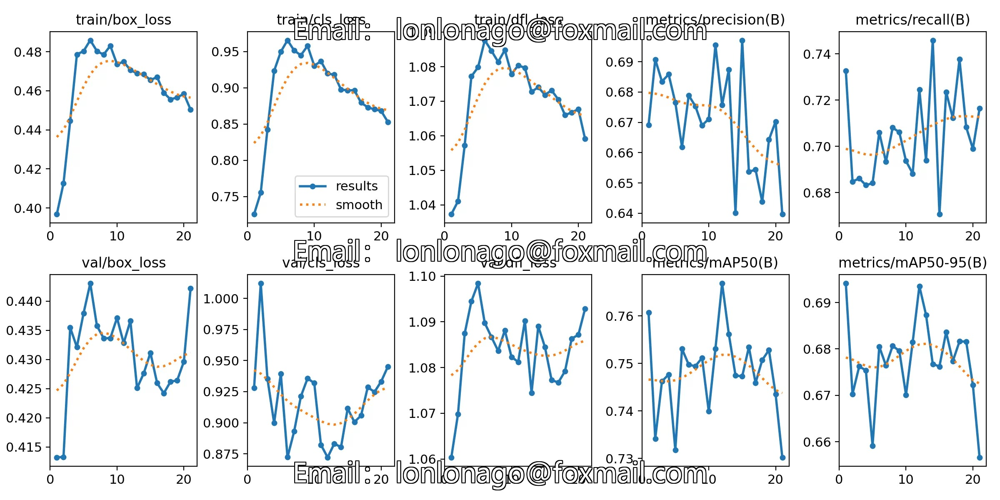
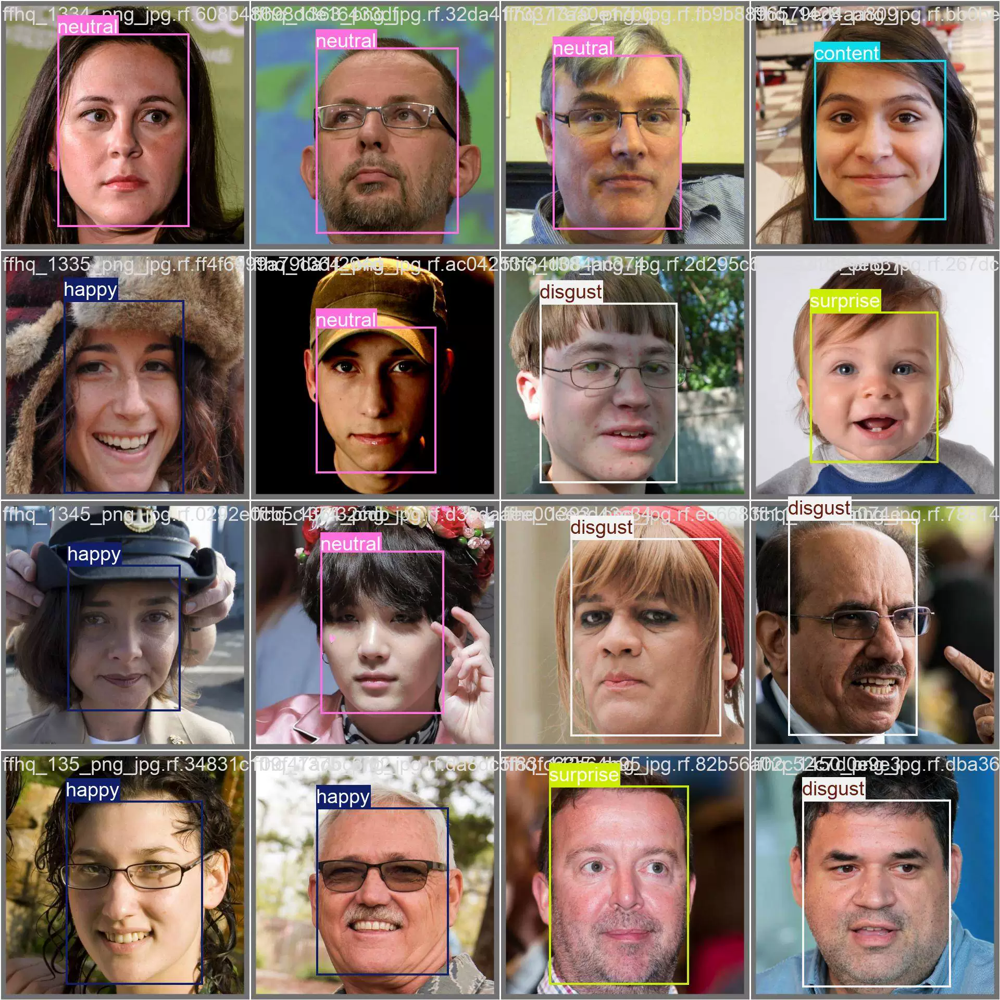

## Body

YOLO Professional Training

YOLO Professional Training offers ample computational power, high efficiency, and can handle a wide range of YOLOv3, YOLOv4, YOLOv5, YOLOv7, YOLOv8, YOLOv9, YOLOv10, YOLOv11, YOLOv12, YOLOv13, YOLOv26 series object detection models. It requires the provision of dataset.

## Images

Here is a pay link on Stripe ( https://buy.stripe.com/3cs8yP7sY87d0vu9AB ). Please contact me lonlonago@foxmail.com after funding $89, and I will send you a complete data files , thank you!

